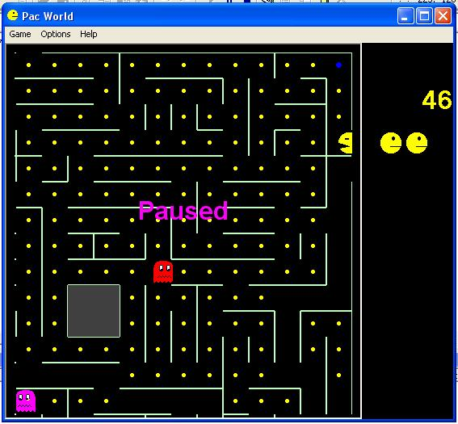

<div align="center">

## A Pacman World


</div>

### Description

PacMan clone(more like replica) written in VB with Windows API and GDI calls. Camera movement allows mazes bigger that the window. I'm still working on a maze editor and there are only two mazes as of yet. If anyone wants to help me with this (make a maze editor or add mazes) I'll be glad if you send me your contribution. **BUG FIX**

I fixed a bug where memory was leaking after resizing the window :)

NEW UPDATE tunnels!
 
### More Info
 


<span>             |<span>
---                |---
**Submitted On**   |2002-11-06 07:11:30
**By**             |[Yoav Shnel](https://github.com/Planet-Source-Code/PSCIndex/blob/master/ByAuthor/yoav-shnel.md)
**Level**          |Intermediate
**User Rating**    |4.7 (14 globes from 3 users)
**Compatibility**  |VB 6\.0
**Category**       |[Games](https://github.com/Planet-Source-Code/PSCIndex/blob/master/ByCategory/games__1-38.md)
**World**          |[Visual Basic](https://github.com/Planet-Source-Code/PSCIndex/blob/master/ByWorld/visual-basic.md)
**Archive File**   |[A\_Pacman\_W1492701162002\.zip](https://github.com/Planet-Source-Code/yoav-shnel-a-pacman-world__1-40437/archive/master.zip)

### API Declarations

```
Public Declare Function PlaySound Lib "winmm.dll" Alias "PlaySoundA" (ByVal lpszName As String, ByVal hModule As Long, ByVal dwFlags As Long) As Long
Public Declare Function BitBlt Lib "gdi32" (ByVal hdestDC As Long, ByVal X As Long, ByVal Y As Long, ByVal nWidth As Long, ByVal nHeight As Long, ByVal hSrcDC As Long, ByVal xSrc As Long, ByVal ySrc As Long, ByVal dwRop As Long) As Long
Public Declare Function StretchBlt Lib "gdi32" (ByVal hdc As Long, ByVal X As Long, ByVal Y As Long, ByVal nWidth As Long, ByVal nHeight As Long, ByVal hSrcDC As Long, ByVal xSrc As Long, ByVal ySrc As Long, ByVal nSrcWidth As Long, ByVal nSrcHeight As Long, ByVal dwRop As Long) As Long
Private Declare Function LoadImage Lib "user32" Alias "LoadImageA" (ByVal hInst As Long, _
 ByVal lpsz As String, ByVal un1 As Long, ByVal n1 As Long, ByVal n2 As Long, ByVal un2 As Long) As Long
Private Declare Function CreateBitmap Lib "gdi32" (ByVal nWidth As Long, ByVal nHeight As Long, _
 ByVal nPlanes As Long, ByVal nBitCount As Long, lpBits As Any) As Long
Public Declare Function CreateCompatibleBitmap Lib "gdi32" (ByVal hdc As Long, ByVal nWidth As Long, ByVal nHeight As Long) As Long
Public Declare Function CreateCompatibleDC Lib "gdi32" (ByVal hdc As Long) As Long
Public Declare Function GetDC Lib "user32" (ByVal hwnd As Long) As Long
Private Declare Function SetBkColor Lib "gdi32" (ByVal hdc As Long, ByVal crColor As Long) As Long
Private Declare Function FillRect Lib "user32" (ByVal hdc As Long, lpRect As RECT, _
 ByVal hBrush As Long) As Long
Private Declare Function CreateSolidBrush Lib "gdi32" (ByVal crColor As Long) As Long
Private Declare Function GetObject Lib "gdi32" Alias "GetObjectA" _
 (ByVal hObject As Long, ByVal nCount As Long, lpObject As Any) As Long
Public Declare Function SelectObject Lib "gdi32" (ByVal hdc As Long, ByVal hObject As Long) As Long
Public Declare Function DeleteObject Lib "gdi32" (ByVal hObject As Long) As Long
Public Declare Function DeleteDC Lib "gdi32" (ByVal hdc As Long) As Long
Public Declare Function GetPixel Lib "gdi32" (ByVal hdc As Long, ByVal X As Long, ByVal Y As Long) As Long
```


